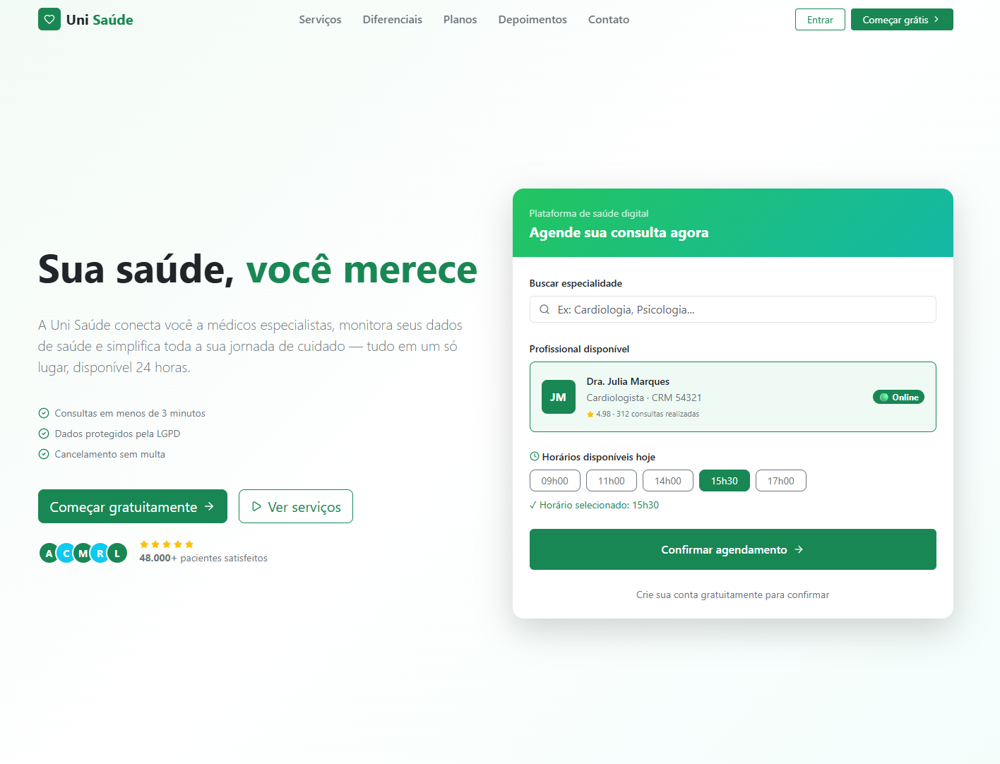

# Uni Saúde — Plataforma de Serviços Digitais de Saúde


---

## Integrantes

| Gabriel de Azevedo Silva
| Paulo Victor Rodrigues Moraes

Trabalho acadêmico desenvolvido para a disciplina de **Desenvolvimento Web Front-End**.

---

## Interface



---

## Sobre o Projeto

A **Uni Saúde** é uma aplicação web desenvolvida em React que simula o portal institucional de uma plataforma de saúde digital. O projeto representa uma interface moderna para apresentação de serviços, funcionalidades e planos de uma healthtech brasileira fictícia.

A aplicação foi construída seguindo os princípios de **componentização**, **Design System** e **responsividade Mobile First**, utilizando Bootstrap como base estrutural e Lucide React para ícones.

---

## Funcionalidades

- Navegação fixa com scroll suave entre seções e menu responsivo para dispositivos móveis
- Banner principal com card interativo de agendamento de consulta
- Seção de serviços com 6 cards dinâmicos gerados a partir de array de dados
- Seção de diferenciais com métricas de impacto e cards de vantagens competitivas
- Seção de planos de assinatura com destaque no plano mais popular
- Seção de depoimentos com avaliações de pacientes e selos de confiança
- Formulário de contato funcional com validação e feedback de envio
- Rodapé completo com links de navegação e botão de retorno ao topo

---

## Tecnologias Utilizadas

| Tecnologia       | Versão | Finalidade                                               |
| ---------------- | ------ | -------------------------------------------------------- |
| **React**        | 18     | Biblioteca principal para construção da interface        |
| **Vite**         | 5      | Ferramenta de build e servidor de desenvolvimento        |
| **Bootstrap**    | 5.3    | Framework CSS para grid responsivo e componentes visuais |
| **Lucide React** | 0.383  | Biblioteca de ícones vetoriais                           |
| **Node.js**      | 18+    | Ambiente de execução JavaScript                          |

---

## Estrutura do Projeto

```
unisaude/
├── public/
│   └── favicon.svg
├── src/
│   ├── components/
│   │   ├── NavBar.jsx              # Barra de navegação com menu responsivo
│   │   ├── HeroSection.jsx         # Banner principal com card de agendamento
│   │   ├── ServiceCard.jsx         # Card individual de serviço (reutilizável)
│   │   ├── ServicesSection.jsx     # Seção com grid de serviços
│   │   ├── DifferentialsSection.jsx# Seção de diferenciais e métricas
│   │   ├── PlansSection.jsx        # Seção de planos de assinatura
│   │   ├── TestimonialsSection.jsx # Seção de depoimentos
│   │   ├── ContactSection.jsx      # Seção de contato com formulário
│   │   └── Footer.jsx              # Rodapé da aplicação
│   ├── data/
│   │   └── index.js               # Dados centralizados da aplicação
│   ├── App.jsx                    # Componente raiz
│   ├── main.jsx                   # Ponto de entrada da aplicação
│   └── index.css                  # Estilos globais e variáveis de cor
├── index.html
├── package.json
└── vite.config.js
```

---

## Arquitetura e Decisões Técnicas

### Componentização

A aplicação é dividida em componentes com responsabilidade única, seguindo o princípio **Single Responsibility** do SOLID. Cada seção da página é um componente independente, facilitando manutenção e reuso.

### Dados Centralizados

Todos os dados estáticos da aplicação — serviços, planos, depoimentos, métricas e links de navegação — estão centralizados no arquivo `src/data/index.js`. Os componentes recebem esses dados via **props**, demonstrando o fluxo de dados unidirecional do React.

### Design System

A aplicação utiliza Bootstrap 5.3 como base estrutural, seguindo a filosofia **Mobile First**: o layout nasce empilhado em mobile e expande horizontalmente conforme a largura de tela aumenta, utilizando os breakpoints `col-12`, `col-sm-6` e `col-lg-4`.

As cores da marca são definidas como variáveis CSS no `index.css`, garantindo consistência visual em toda a aplicação.

### Grid System

O sistema de grid de 12 colunas do Bootstrap é aplicado em todas as seções:

- **Mobile** (`col-12`): 1 card por linha
- **Tablet** (`col-sm-6`): 2 cards por linha
- **Desktop** (`col-lg-4` / `col-lg-3`): 3 a 4 cards por linha

---

## Como Executar

### Pré-requisitos

- Node.js versão 18 ou superior instalado
- npm ou yarn

### Instalação e execução

```bash
# 1. Clone o repositório
git clone https://github.com/azevedosvg/unisaude.git

# 2. Acesse a pasta do projeto
cd unisaude

# 3. Instale as dependências
npm install

# 4. Inicie o servidor de desenvolvimento
npm run dev

# 5. Acesse no navegador
# http://localhost:5173
```

---

## Requisitos Atendidos

| Requisito                                | Status                                      |
| ---------------------------------------- | ------------------------------------------- |
| Projeto criado com Vite + React          | Atendido                                    |
| Componentização com componentes próprios | Atendido — 9 componentes                    |
| Uso de props para conteúdo dinâmico      | Atendido — NavBar, HeroSection, ServiceCard |
| Integração com Bootstrap (Trilha 1)      | Atendido                                    |
| Ícones com Lucide React                  | Atendido                                    |
| Responsividade Mobile First              | Atendido                                    |
| Header com nome, menu e navegação        | Atendido                                    |
| Banner principal com título e CTA        | Atendido                                    |
| Mínimo de 4 cards de serviços            | Atendido — 6 cards                          |
| Seção de destaque com diferenciais       | Atendido                                    |
| Footer com informações da aplicação      | Atendido                                    |
| Estilização complementar ao Bootstrap    | Atendido — variáveis CSS customizadas       |

---

## Referências

- [Documentação do React](https://react.dev)
- [Documentação do Bootstrap](https://getbootstrap.com/docs/5.3)
- [Documentação do Vite](https://vitejs.dev)
- [Lucide React](https://lucide.dev)

---

_Desenvolvido para fins acadêmicos — 2026_
